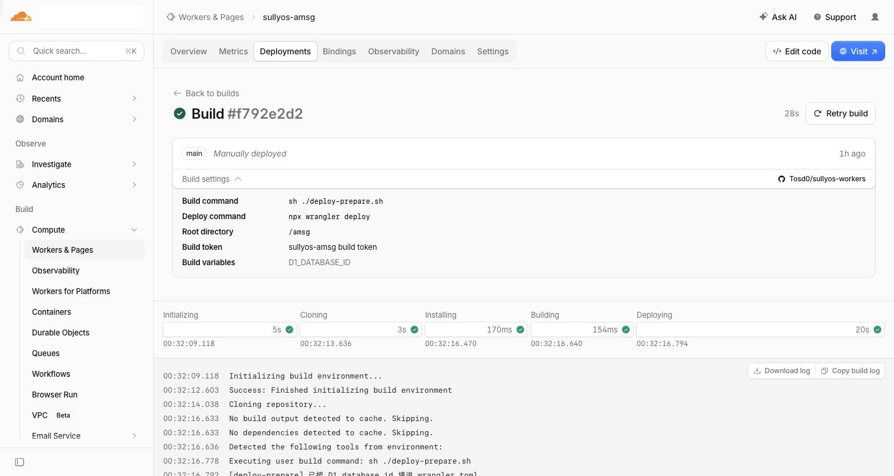
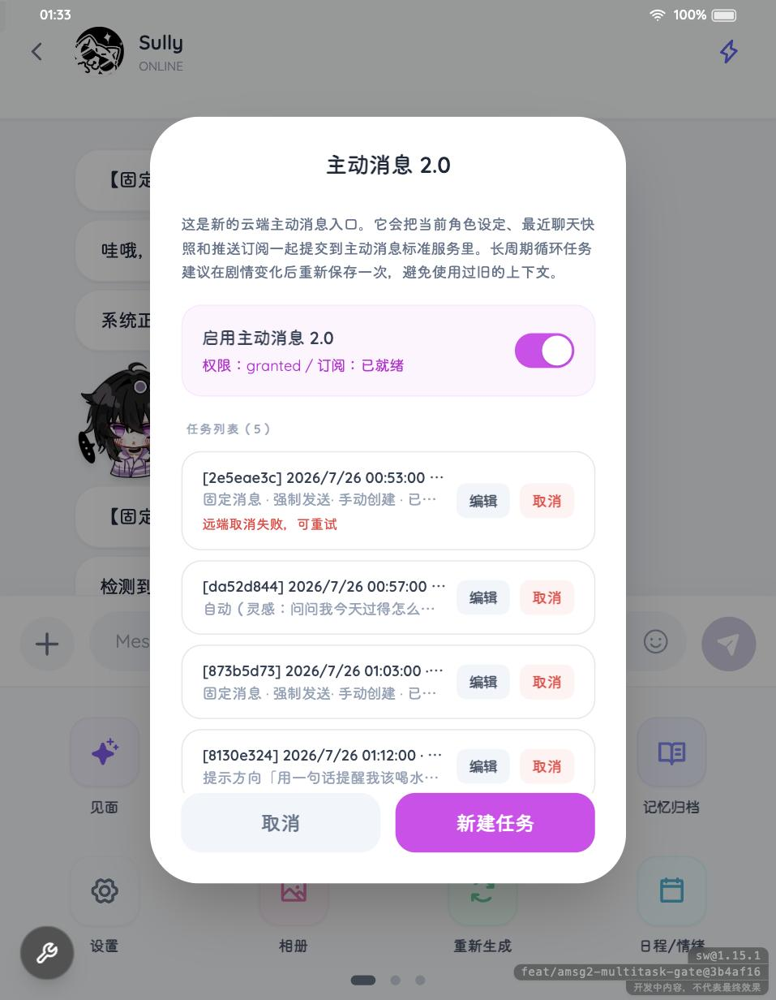
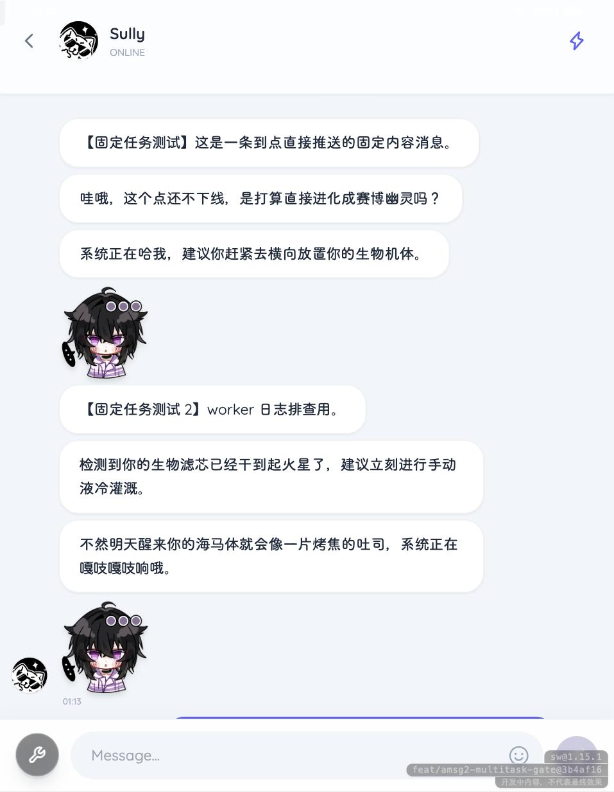

# 主动消息 2.0 · 从零开始的部署手册

「主动消息 2.0」让角色到点自己给你发消息——App 关着、手机锁屏也能收到。

它需要一个只属于你的小后端（一个 Cloudflare Worker + 一个数据库）。**全程只在网页上点，不用装任何东西、不用敲命令**。

装法有三条，选一条走完就行：

| | [在 SullyOS 里装](#在-sullyos-里装推荐) | [用 Cloudflare 的部署按钮](#用-cloudflare-的部署按钮) | [跟着六步装](#第一步--把后端仓库-fork-一份) |
|---|---|---|---|
| 要几个账号 | 只要 Cloudflare | GitHub + Cloudflare | GitHub + Cloudflare |
| 花多久 | 大约 2 分钟 | 大约 5 分钟 | 大约 15 分钟 |
| 你要经手的东西 | 一枚 Token | 一枚 Token 都不用，但要填 4~5 个密钥 | 同左，另外还要建库、连仓库 |
| 适合 | **绝大多数人，手机上尤其**| 想让 Cloudflare 替你建仓库 | 想看清每一步在干什么 |

三条路装出来的东西完全一样，以后更新也都是在 SullyOS 里点一下。

> 还有第四条：把后端代码从网页上复制、贴进 Cloudflare 的在线编辑器，什么账号之外的东西都不经手。见文末的[附录 · 不用 GitHub 怎么装](#附录--不用-github-怎么装)。

---

## 在 SullyOS 里装（推荐）

只要一个 Cloudflare 账号（用 GitHub 或邮箱都能注册），不需要 GitHub。密钥全部由 SullyOS 就地生成，你一个都不用抄。

### 第 1 步 · 建一枚 API Token

打开 <https://dash.cloudflare.com/profile/api-tokens> → **Create Token** → 最下面的 **Custom token** → **Get started**。

**Permissions** 这三行都要加上（点 *+ Add more* 加行）：

| 类型 | 名称 | 权限 |
|---|---|---|
| Account | Workers Scripts | Edit |
| Account | D1 | Edit |
| Account | Account Settings | Read |

**Account Resources** 选你要把后端装进去的那个账号。

**TTL** 那两个日期框：**Start Date 留空**。填了未来的日期，这枚 Token 要到那天才生效，在那之前用会一直被 Cloudflare 拒掉。

点 **Continue to summary** → **Create Token**，把生成的那串复制下来（**它只显示这一次**）。

### 第 2 步 · 粘进 SullyOS

打开 SullyOS → 底部齿轮 **系统设置** → 滚到最底部 → **主动消息 2.0** 右边的 **配置** → 最上面那块 **一键部署**。

把 Token 粘进输入框，点 **开始部署**。等十几秒就好了。

这十几秒里它替你做完了：建数据库、上传后端代码、写入全部密钥、加上每分钟的定时触发、开好访问地址，然后连上。做完就能用了。

### 中途可能会问你两件事

**「这枚 Token 能用在多个账号上，装到哪个？」** —— 你的 Cloudflare 名下不止一个账号时会问。点一下要装的那个就继续了。（建 Token 时在 Account Resources 里只选一个账号的话，这一步不会出现。）

**「给这个账号起一个 workers.dev 子域名」** —— 全新的 Cloudflare 账号才会遇到。这个名字全 Cloudflare 唯一，定了之后是这个账号所有 Worker 共用的，起一个自己认得的就行，之后后端地址会长成 `sullyos-amsg.你填的.workers.dev`。

### 关于这枚 Token

浏览器不能直接调 Cloudflare 的接口（它不给跨域），所以部署时这枚 Token 会经过 SullyOS 的网络代理 Worker 转发一次。这一点写在按钮下方，介意的话可以走下面两条路。

部署完成后，它会作为密钥存进**你自己的那个 Worker**——以后在设置页点「更新 Worker」，是那个 Worker 拿着它自己更新自己，不再经过浏览器。SullyOS 这边用完就丢，不保存。

装完直接跳到[第六步](#第六步--给角色排第一条主动消息)给角色排第一条消息。

---

## 用 Cloudflare 的部署按钮

Cloudflare 会替你把仓库、数据库、定时任务一次性建好，你只要在一个页面上把几个密钥填进去。这条路需要一个 GitHub 账号。

### 先在 SullyOS 里把要填的东西准备好

打开 SullyOS → 底部齿轮 **系统设置** → 滚到最底部。

**推送凭据 (VAPID)**：点标题右边的小箭头展开 → **生成 VAPID 密钥对 →** → 弹窗里点 **生成新密钥对** → **保存**。再点开一次，把「VAPID 公钥」和「VAPID 私钥」分别复制出来存好。

**主动消息 2.0**：点这一节右边的 **配置** → 展开 **手动部署 Worker（想自己一步步来）** → 找到 **AMSG_MASTER_KEY** 点 **生成并复制**，存好。再往下滚到 **共享密钥（可选）**，点右边的 **随机**，也存好。

### 点按钮

[](https://deploy.workers.cloudflare.com/?url=https://github.com/Tosd0/sullyos-workers/tree/main/amsg)

<https://deploy.workers.cloudflare.com/?url=https://github.com/Tosd0/sullyos-workers/tree/main/amsg>

跳过去之后：

1. **Git account** 选你的 GitHub 账号（第一次用会让你授权，同意即可）
2. 往下每个密钥一个输入框，把刚才存的几串填进去。每个框下面都写了它是什么、去哪儿取
   - `VAPID_EMAIL` 和 `AMSG_SERVER_TOKEN` 是可选的，不填也能跑
3. 点右下角 **Deploy**

页面会跳到构建进度，半分钟左右完成。数据库、每分钟的定时触发器、workers.dev 地址都会自动配好，不用管。

> **如果你已经装过一个**：`Project name` 和数据库名默认都叫 `sullyos-amsg`，跟已有的那个撞名。而且 **D1 那栏会自动选中同名的已有数据库**——不改的话两个后端会共用一个库。装第二个的话，把项目名和数据库名都改一下（比如加个后缀）。只装一个就不用操心。

建好之后，Worker 的 **Overview** 页里标题下面那个 `https://xxx.workers.dev` 就是地址，复制它，然后跳到[第五步](#第五步--回-sullyos-连上)把它填回 SullyOS。

---

## 跟着六步装

下面是把上面那几下拆开的版本：每一步在建什么、填到哪儿都看得见。上面两条路已经装好了的话，这六步跳过就行。

---

## 第一步 · 把后端仓库 fork 一份

1. 打开 <https://github.com/Tosd0/sullyos-workers>
2. 点页面右上角的 **Fork** → 保持默认 → **Create fork**

完成后你的账号下就多了一个同名仓库。以后上游有更新，你回到这个页面点一下 **Sync fork** 就行，Cloudflare 会自动重新部署。

---

## 第二步 · 建一个数据库

角色的定时任务要存在数据库里。

1. 打开 <https://dash.cloudflare.com> 并登录
2. 左侧菜单 **Storage & databases** → **D1 SQLite Database**
3. 右上角 **Create Database**
4. **Name** 填 `sullyos-amsg`，其余保持默认，点 **Create**
5. 建好后会自动跳进这个库的 Overview 页。页面上方有一串像 `6d726bb3-6ea3-45dd-80d8-72ad6bd49446` 的编号，这就是 **Database ID**。点它右边的复制按钮，先存在记事本里，下一步要用。

> 表结构不用管，后面在 SullyOS 里点「连接」时会自动建好。

---

## 第三步 · 用刚才的仓库创建 Worker

1. Cloudflare 左侧菜单 **Compute** → **Workers & Pages**
2. 右上角 **Create application**
3. 选 **Continue with GitHub**（第一次用会跳到 GitHub 让你授权，同意即可）
4. 在出现的仓库列表里选中第一步 fork 的 **sullyos-workers**，点右下角 **Next**
5. 页面往下滚，进入 **Set up your application**，按下面填：

   | 位置 | 填什么 |
   |------|--------|
   | Project name | `sullyos-amsg` |
   | Build command | `sh ./deploy-prepare.sh` |
   | Deploy command | 保持默认的 `npx wrangler deploy` |

6. 点下方的 **Advanced settings** 展开，继续填：

   | 位置 | 填什么 |
   |------|--------|
   | Path | `/amsg` |
   | API token | 下拉选 **Create new token**，然后在出现的 **API token name** 里随便起个名字（比如 `sullyos-amsg build token`）；它会显示「A new token will be created automatically」 |
   | Variable name | `D1_DATABASE_ID` |
   | Variable value | 粘贴第二步复制的那串 Database ID |

   > Variable value 旁边有个 **Encrypt** 按钮，**不要点**——这个值需要在构建时被读出来。

7. 点右下角 **Deploy**

页面会跳到构建进度。**这个页面不会自动刷新**，看起来一直卡在 Initializing 是正常的，手动刷新一下就能看到真实状态。顺利的话 30 秒左右完成，日志里会出现这两行：

```
[deploy-prepare] 已把 D1 database_id 填进 wrangler.toml。
env.DB (sullyos-amsg)   D1 Database
```



> 数据库绑定和「每分钟检查一次」的定时触发器都写在仓库里，会自动带上，不用手动加。

---

## 第四步 · 填钥匙（Secrets）

这一步要在 SullyOS 和 Cloudflare 之间来回一次，先把 SullyOS 那边的值生成出来。

### 4a. 在 SullyOS 里生成两组值

打开 SullyOS → 底部齿轮 **系统设置** → 往下滚到最底部。

**先做「推送凭据 (VAPID)」**（这是浏览器推送用的签名密钥，全站共用一对）：

1. 点标题右边的小箭头展开 → 点 **生成 VAPID 密钥对 →**
2. 弹窗里点 **生成新密钥对**，会出现「VAPID 公钥」和「VAPID 私钥」两段
3. 点 **保存**
4. 再点开一次，用每一栏右上角的 **复制** 分别把公钥、私钥存到记事本

**再做「主动消息 2.0」**：

1. 点这一节右边的 **配置**
2. 弹窗里点 **手动部署 Worker（想自己一步步来）** 右边的 **展开**
3. 找到 **AMSG_MASTER_KEY** → 点 **生成并复制**，屏幕上会显示 `AMSG_MASTER_KEY=` 加一串 64 位字符，整行存进记事本
4. 往下滚到 **共享密钥（可选）** → 点右边的 **随机**，它会生成一串密码自动填进输入框，下方显示 `AMSG_SERVER_TOKEN=` 开头的整行并复制到剪贴板。**这一串等下也要填到 Cloudflare**，同样整行存进记事本（输入框是密码框看不见内容，下方那行就是给你抄的）

> 「共享密钥」的作用：填了以后，别人光知道你的 Worker 地址也调不动它。

### 4b. 回 Cloudflare 填进去

1. 回到 Cloudflare 的 Worker 页面（Workers & Pages → `sullyos-amsg`）
2. 顶部选 **Settings**
3. 最上面一块就是 **Variables and secrets**，点右边的 **+ Add**
4. 右侧滑出的面板里，每一条都是「Type / Variable name / Value」三格。记事本里 `变量名=值` 那样的整行可以直接粘进去，Cloudflare 会自动拆开填好名字和值两格。填完一条点下面的 **Add variable** 加下一条，一共五条：

   | Type | Variable name | Value |
   |------|---------------|-------|
   | Secret | `AMSG_MASTER_KEY` | 4a 生成的那串 64 位字符 |
   | Secret | `VAPID_PUBLIC_KEY` | VAPID 公钥 |
   | Secret | `VAPID_PRIVATE_KEY` | VAPID 私钥 |
   | Text | `VAPID_EMAIL` | `mailto:你的邮箱` |
   | Secret | `AMSG_SERVER_TOKEN` | 4a 那串「共享密钥」 |

5. 五条都填完，点右下角 **Deploy**

> ⚠️ VAPID 那两条**必须**和 SullyOS 面板里的是同一对。整个站点只有一个浏览器推送订阅，Worker 用别的密钥对去签名，推送会被浏览器直接丢掉——表现就是「哪儿都显示正常，就是收不到消息」。

填完可以顺手确认两件事（都在同一个 Settings 页往下滚）：

- **Trigger events** 里有一条 `Cron / scheduled() / * * * * *`
- 顶部 **Bindings** 标签里有一个名为 `DB` 的 D1 database

### 4c. 复制 Worker 地址

回到 Worker 的 **Overview** 页，标题下面那个 `https://xxx.workers.dev` 就是地址，复制它。

---

## 第五步 · 回 SullyOS 连上

**系统设置** → **主动消息 2.0** → **配置**，滚到「当前状态」这一块：

1. **WORKER 地址** 粘贴上一步复制的地址
2. **共享密钥（可选）** 确认里面就是 4a 生成的那串（如果空了就重新粘一次）
3. 点 **连接并启用**

右上角变成绿色的 **已连接** 就成功了——数据库表也是这一下自动建好的。

4. 继续往下，点 **开启通知与推送**，浏览器会弹出通知权限请求，选「允许」

「通知权限」显示 **已开启** 之后，后端部分就全部完成了。

---

## 第六步 · 给角色排第一条主动消息

1. 回到桌面，进入任意角色的聊天页
2. 点输入框左边的 **＋**
3. 在弹出的功能面板里找到 **主动消息 2.0**（面板有好几页，可以左右翻）
4. 把 **启用主动消息 2.0** 的开关打开，下面就会出现任务列表和新建表单



新建一个任务要选三样东西：

**① 消息怎么来**

| 类型 | 说明 |
|------|------|
| 固定 | 到点直接发你写好的那段话，不经过 AI |
| 自动 | 到点让角色按人设和最近的聊天自己想一句 |
| 提示词 | 你给个方向（比如「提醒我喝水」），角色围绕它自由发挥 |

**② 什么时候发**

「首次发送时间」选日期时间，「重复方式」选 一次 / 每天 / 每周。

**③ 到点时如果你正在聊天怎么办**（选「自动」或「提示词」时才会出现）

| 选项 | 行为 |
|------|------|
| 自动作废 | 你刚刚还在跟角色聊，这条就不发了，避免答非所问 |
| 强制发送 | 闹钟型，不管你在不在聊都照发 |

填好点 **新建任务**。到点后消息会以系统通知的形式弹出来，同时落进聊天记录里：



任务列表里每条都能单独 **编辑** 或 **取消**。

---

## 出问题时怎么查

**排好的任务到点没反应**

1. Cloudflare → 你的 Worker → **Settings** → 往下找 **Trigger events**，确认有 `* * * * *` 那条。没有的话：连仓库装的多半是第三步 Path 填错、没指到 `amsg` 目录；照附录手动贴代码装的，就是那条定时触发器还没加（附录 E）。用部署按钮装的这条是自动配好的，一般不会缺。
2. 还是不行就开日志：同一页往下找 **Observability** → **Logs** 那一行右边的铅笔 → 把开关打开 → **Deploy**。之后到 顶部 **Observability** 标签就能看到每分钟一条的 `* * * * *`，点开能看到那次运行有没有报错。

**看起来都正常，就是收不到消息**

九成是 VAPID 对不上。回第四步核对：Cloudflare 里的 `VAPID_PUBLIC_KEY` / `VAPID_PRIVATE_KEY` 必须和 SullyOS「推送凭据 (VAPID)」面板里显示的完全一致。改过之后要在 SullyOS 里重新点一次「开启通知与推送」。

**面板上说「这次没写出要说的话」，或者即时对话提示「模型这轮没有生成内容」**

后端跑完了，模型也回了话，只是回来的内容里没有能发出去的正文。这种情况有好几种成因，要看日志才分得清：

1. 按上面的办法打开 Observability 日志，到 **Observability** 标签里搜 `amsg:skip-diag`，点开最近的那一条。
2. 对照这几项看：
   - `finishReason` 是 `length`、`reasoningChars` 很大：思考把输出额度用光了，正文没来得及写。换个不带思考的模型试试
   - `finishReason` 是 `content_filter`，或者 `contentType` 是 `null` 且 `toolCalls` 是 `0`：被模型那边的内容审核拦下了
   - `contentChars` 有数、`visibleChars` 是 `0`：模型把整段话都写进了思考块（`<think>` 里）
   - `contentType` 是 `array`：这个接口返回的格式后端认不出来，换个接口地址或渠道试试
3. 还是看不出来的话，去 Worker → **Settings** → **Variables and secrets** 加一个变量 `AMSG_DEBUG_LLM_RAW`，值填 `1`。之后再遇到，同一条日志里会多出一个 `raw`，是模型回复的开头几百字。这段会带上聊天内容，查完记得把变量删掉。

**SullyOS 里点「连接」失败**

提示里如果直接写了「缺 XXX」，那就是后端自己报的，照着补完再点一次就行（第四步那张表列了每个密钥是什么；用部署按钮装的去 Worker → **Settings** → **Variables and secrets** 补）。

其它情况按这几条排：

- 地址是不是抄全了（要带 `https://`，末尾不要多斜杠）
- 「共享密钥」和 Cloudflare 里的 `AMSG_SERVER_TOKEN` 是不是一模一样
- 直接在浏览器打开 `你的地址/config-check`：后端会自己列出配置齐不齐。`"ok": true` 就是钥匙都填对了，问题在地址或密钥没对上；`"ok": false` 时后面的 `message` 会写明缺哪一样、去哪儿补。什么都打不开才是后端没起来，去看第三步的构建日志。
- 上面这个地址挂梯子能打开、不挂就打不开：那是 `workers.dev` 在国内连不上，不是后端的问题，见下面「国内连不上 workers.dev 怎么办」。

**连上了，但 `config-check` 的 `warnings` 里有东西**

那几条是「能跑，但有一块是哑的」，界面上看不出来，所以单独列在这儿：

- `VAPID_MISSING`：任务建得成，到点一条都推不出去。回第四步补那两个密钥
- `MASTER_KEY_FORMAT`：`AMSG_MASTER_KEY` 不是 64 位十六进制，多半是粘贴时少了几位
- `SERVER_TOKEN_MISSING`：没设共享密钥，这个地址知道的人都能读写你的任务。介意的话回第 4a 步生成一个

**上面都试过还是不行 / 想找人帮忙看**

打开 `你的地址/debug`，把返回的那段 JSON 整个贴给对方。它比 `config-check` 多报数据库和定时任务的状况，一份就够判断问题出在哪。这个地址只读、不需要密钥，也不会返回任何密钥的值、你的用户标识或消息内容，贴出来是安全的。

自己看的话重点是这几项：`storage.missingColumns` 有东西 = 换了新版本没重新点「连接并验证」；`storage.pushSubscriptionRegistered` 是 `false` = 云端没有推送订阅（去把推送开关关掉再打开）；`tick` 是 `stalled` = 有任务到点很久没被处理，多半是定时触发器没配。

**构建失败，日志里写 `D1_DATABASE_ID 是空的`**

那个变量没设，或者设的时候点了 Encrypt。回到 Worker → **Settings** → 往下找 **Build** → **Variables**，加一个 `D1_DATABASE_ID`（普通变量，不加密），值是第二步的 Database ID，然后重新部署。

---

## 国内连不上 workers.dev 怎么办

`https://xxx.workers.dev` 这个域名在国内的网络环境下打不开。表现是第五步点「连接」一直失败，但把地址挂梯子打开又是正常的。

办法是给它加一个门面：Worker、数据库、定时任务全都留在 Cloudflare 不动，只在外面套一层 Deno——它什么都不做，只把请求原样转给你的 Worker，再把回复原样送回来。Deno 给的是 `xxx.deno.net` 域名，国内能直连。

**先知道两件事**

- **收消息不走这一层。** 推送是 Cloudflare 直接发给手机的，跟你用什么地址打开设置面板是两条独立的路。所以这层就算挂了也收得到消息，只是改不了配置。
- **不用绑卡。** 没验证过的 Deno 账号只有免费额度的 1%（每月一万次请求），但 SullyOS 只在你点「连接」、打开设置面板、开推送这几下才会请求 Worker，一万次够用很久。

**动手**

1. 打开 [console.deno.com](https://console.deno.com)，用 GitHub 账号登录，点右上角 **New Playground**
2. 回 SullyOS：**系统设置** → **主动消息 2.0** → **配置**，在「WORKER 地址」下面点开 **这个地址连不上？在外面套一层 Deno**，点 **复制 Deno 代理代码**
3. 回 Playground，编辑器里全选、粘贴覆盖
4. 找到开头 `UPSTREAM` 那一行，把引号里的地址换成你自己的 `https://xxx.workers.dev`
5. 点右上角 **Deploy**，等构建跑完，标题旁边会出现 `https://xxx.deno.net`
6. 把这个 `deno.net` 地址填回 SullyOS 的「WORKER 地址」，替换掉原来的，重新点一次 **连接并启用**

> 不想把 Worker 地址写在代码里的话，第 4 步可以不改，改成在 Playground 的 **Env Variables** 里加一个 `AMSG_UPSTREAM`，值填你的 Worker 地址。两种都行，环境变量优先。

**怎么确认这层是活的**

浏览器打开 `你的deno.net地址/__proxy-health`。看到 `"ok": true` 和你填的上游地址就对了；`"ok": false` 说明 `UPSTREAM` 那行还是原来的占位符，没改成自己的地址。

**一个会变的地方**

设置面板里「去 Cloudflare 控制台」那个链接原本能直接跳到你那个 Worker 的页面，靠的是从 `workers.dev` 域名反推 Worker 名字。换成 `deno.net` 之后推不出来了，会跳到 Worker 列表页，自己再点一下。

---

## 以后怎么更新

**在 SullyOS 里点一下就行**：**系统设置** → **主动消息 2.0** → **配置**，「连接并启用」下面有个 **更新 Worker**。有新版可更时它会变成绿色实心按钮并写明更新到哪一版，平时是浅色的，随时可以点。

点了之后后端自己去取最新代码覆盖自己，你排好的任务、填过的密钥、数据库绑定都不动。更新完会自动验证一次（顺带把新版可能要的表建好），并显示一串代码指纹，用来确认这次确实换了版本。

**用[「在 SullyOS 里装」](#在-sullyos-里装推荐)那条路装的，这把钥匙部署时已经放进去了**，直接点更新就行，下面这段跳过。

另外两条路装的，第一次点更新会提示缺一把钥匙，同一块地方就能补上（做一次就够）：

1. 打开 <https://dash.cloudflare.com/profile/api-tokens> → **Create Token** → 拉到最下面的 **Custom token** → **Get started**
2. **Permissions** 只加一行：`Account` / `Workers Scripts` / `Edit`
3. **Account Resources** 选你的账号；**Start Date 留空**，然后 **Continue to summary** → **Create Token**，复制显示出来的那串
4. 回到 SullyOS 的这一块，把它粘进 **给这台后端补一把更新用的钥匙**，点 **装上钥匙**

之后更新就都是点上面那个按钮了。

> 这一步只往你的 Worker 里加这一条密钥，代码、数据库、已经填过的密钥都不动。
>
> 这把钥匙只能改 Workers，读不到你的数据库内容。写进去之后就留在你自己的 Worker 里，SullyOS 不保存。
>
> 也可以自己去 Cloudflare 面板加：Worker → **Settings** → **Variables and secrets** → **+ Add**，Type 选 `Secret`，名字填 `CF_API_TOKEN`，值粘贴那串，点 **Deploy**。效果一样。

**不想加钥匙的话**，按当初的装法手动更新也行：

- 跟着六步装的：打开你 fork 的那个仓库，点 **Sync fork** → **Update branch**，Cloudflare 检测到新提交会自动重新部署
- 用部署按钮装的：Cloudflare 给你建的是一个独立仓库（不是 fork，所以没有 Sync fork 可点）。先把 <https://github.com/Tosd0/sullyos-workers/raw/main/amsg/worker.bundle.js> 下载下来，再打开你那个仓库 → **Add file** → **Upload files**，把下载的文件拖进去覆盖同名的那个，提交后会自动重新部署。这文件有四十多万字符，网页编辑器打不开，只能整个文件替换
- 照附录手动贴代码装的：见附录最后一节

> 头一次用「更新后端」时，如果提示这台 Worker 还是旧版本、没有这个功能，先按上面的办法手动更新一次，之后就能在 SullyOS 里点了。

---

## 附录 · 不用 GitHub 怎么装

后端代码就是一个文件，从网页上复制下来、贴进 Cloudflare 的在线编辑器就行（GitHub 上的公开文件不登录也能看、也能复制）。适合不想用 GitHub、也不想让 Token 经过任何中转的人。代价是数据库绑定和定时触发器都得自己加，**以后每次更新也要重新复制粘贴一遍**。

这条路只替换六步里的第一步和第三步，其余步骤——第二步建数据库、第四步填钥匙、第五步连回 SullyOS、第六步排任务——完全一样。

> **先看设备**：这份代码有二十多万个字符。电脑上复制粘贴很轻松；手机浏览器就不一定吃得住，卡住或者贴不进去都有可能。手边只有手机的话，走[在 SullyOS 里装](#在-sullyos-里装推荐)那条要省事得多——那边手机上只要粘一枚 Token。

### A · 建数据库

照第二步做，但**不用复制 Database ID**：这条路是在面板上按名字挑库，不填 ID。

### B · 建一个空 Worker

1. Cloudflare 左侧 **Compute** → **Workers & Pages** → 右上角 **Create application**
2. 选 **Start with Hello World!**（这一屏上面那两个是连 GitHub / GitLab 的，跳过）
3. **Worker name** 填 `sullyos-amsg`——这个名字就是你以后的地址：`sullyos-amsg.xxx.workers.dev`
4. 点右下角 **Deploy**

十几秒就好。这会儿它还只会回一句 Hello World，下一步把真代码换进去。

### C · 复制后端代码

浏览器打开（不用登录）：<https://github.com/Tosd0/sullyos-workers/blob/main/amsg/worker.bundle.js>

文件上方那排按钮里，**Raw** 右边那个「两个方块叠在一起」的图标就是复制，点它，整份代码就进剪贴板了。

### D · 贴进 Worker

1. 回到刚建好的 Worker 页面，点右上角 **Edit code**
2. 编辑器里打开的是一个 `worker.js`，在代码区里点一下，全选（Cmd / Ctrl + A）删掉
3. 粘贴刚才复制的代码
4. 点右上角的 **Deploy**

### E · 补上数据库和定时器

跟着六步装的话，数据库绑定和「每分钟检查一次」的定时触发器写在仓库的配置文件里、会自动带上。手动贴代码没有那个文件，这两样要自己加。

**数据库绑定**：Worker 页面顶部 **Bindings** → **Add binding** → 左边列表选 **D1 database** → **Add Binding**，然后：

| 位置 | 填什么 |
|------|--------|
| Variable name | `DB`（就这两个字母，别改） |
| D1 database | 下拉选 A 步建的那个库 |

再点 **Add Binding**。加好后表格里会出现一行 `D1 database / DB / 你的库名`。

**定时触发器**：Worker 页面 **Settings** → 往下找 **Trigger events** → **Add** → 选 **Cron triggers**，然后：

- **Schedule** 那栏：Execute Worker every → 单位选 **Minute(s)**，数字填 `1`
- 也可以切到 **Cron expression** 直接填 `* * * * *`，一个意思

点 **Add**。加好后 Trigger events 表格里会出现一条 `Cron / scheduled() / * * * * *`。

这两条加完，回[第四步](#第四步--填钥匙secrets)填钥匙。

> 这样建出来的 Worker，日志默认就是开的——出问题直接去顶部 **Observability** 标签看，不用再去打开什么开关。

### 这条路以后怎么更新

上游发了新版本之后，重做 C、D 两步：复制新代码 → **Edit code** → 全选替换 → **Deploy**。

数据库绑定、定时触发器、填过的钥匙都不会跟着丢，换掉的只有代码。
